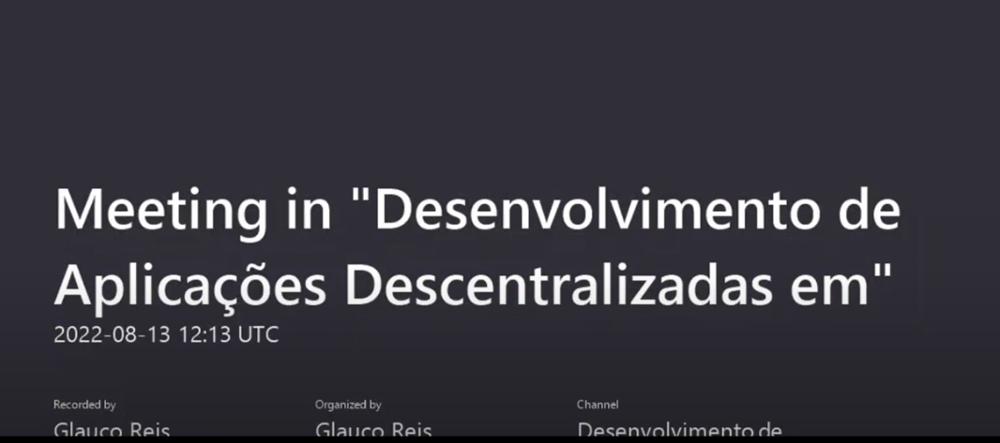

# Aulas Blockchain 

Este programa é uma variação do carbuilder, o programa que permite solicitar a construção de um veículo, a sua consttrução e criação do seguro
O passo a passo para executtar está neste vídeo abaixo
É um programa blockchain, e depois de executado fica com esta topologia

[(https://youtu.be/WvyLn2Yol7c)
